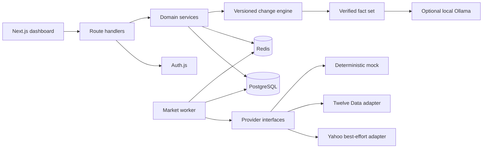
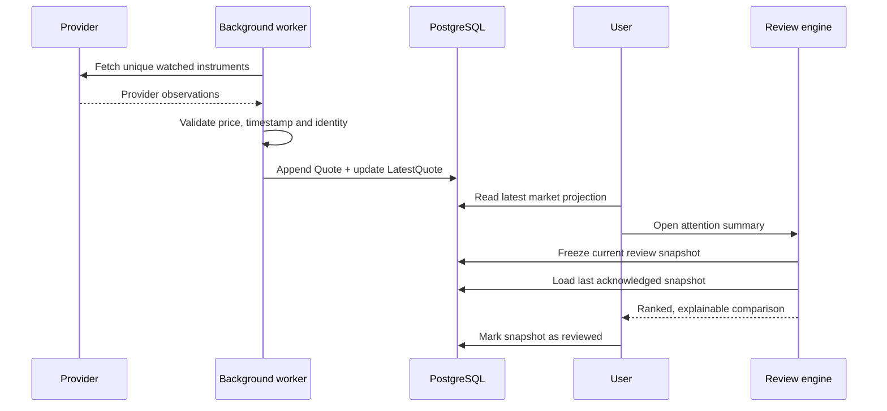

<div align="center">

# MarketPulse

### A smart market watchlist that remembers what you have already seen.

**Track the market. Return later. See only what meaningfully changed.**


</div>

---

## The idea

Most watchlists answer only one question: **what is the price now?**

MarketPulse answers a more useful one:

> **What has meaningfully changed since I last checked, and what deserves my attention now?**

Users can create multiple named watchlists, discover NSE/BSE equities, see the latest accepted market observation, mark a watchlist as reviewed, and return to a stable comparison against that acknowledged point in time.

MarketPulse does not treat every numerical difference as meaningful. It evaluates movement using deterministic, versioned rules and refuses to classify comparisons when the underlying evidence is missing, stale, conflicted, or incompatible.

## The two views are intentionally different

| | Current Market | What changed since you last checked |
|---|---|---|
| **Question answered** | What is the latest stored market position? | What changed from the last review I acknowledged? |
| **Data source** | Mutable `LatestQuote` projection | Immutable review snapshots |
| **Percentage means** | Latest price versus provider `previousClose` | Current review price versus last acknowledged review price |
| **Update behavior** | Changes when the ingestion worker stores a newer quote | Remains frozen and reproducible after the review is created |
| **Primary purpose** | Market awareness | Attention prioritization |

### Current Market

The lower **Latest prices** section reads the newest accepted quote for every instrument from PostgreSQL. It shows:

- latest stored price;
- today's change relative to the provider's previous close;
- availability/freshness status;
- optional volume, provenance, chart, and removal controls.

The browser rereads this local projection every 60 seconds while the tab is visible. It does not contact Yahoo during page rendering. A separate worker refreshes PostgreSQL, so ten viewers of the same stock do not create ten identical upstream requests.

### What changed since you last checked

The upper **Attention summary** is not today's percentage repeated. Opening it creates or reuses a frozen review snapshot. MarketPulse compares that snapshot with the latest earlier snapshot the user explicitly marked as reviewed.

For example:

```text
Friday review:  ₹1,000  ← user marks this as reviewed
Monday review:  ₹1,045
Since-review movement: +4.50%
```

The provider's daily percentage on Monday may be completely different because its baseline is Monday's previous close, not the user's Friday review.

Selecting **Mark as reviewed** acknowledges the visible snapshot. It becomes the baseline for the next review. Snapshots stay immutable so a later quote, backfill, policy change, or AI request cannot rewrite what the user previously saw.

## What counts as a meaningful change?

New reviews use the versioned `daily-context-v5` policy. The default movement levels are:

| Attention | Absolute movement since review |
|---|---:|
| Below threshold | `< 1%` |
| Low | `≥ 1%` |
| Medium | `≥ 2%` |
| High | `≥ 4%` |

A user may configure a custom minimum threshold `T` for an instrument membership. MarketPulse then freezes `T`, `2T`, and `4T` as that review's low, medium, and high bands. Later edits cannot change an older review's meaning.

When sufficient compatible history exists, the engine can add context from:

- movement relative to recent adjusted-close volatility;
- a breakout above or below a recent completed-session range;
- abnormal completed-session volume relative to its recent median;
- a reversal between the review-period direction and today's session direction.

Historical context never bypasses the user's minimum movement threshold. Volatility requires at least 11 completed daily bars; range and volume context require at least 10. Corporate-action-like adjustment discontinuities cause raw range comparisons to be withheld.

### Confidence and refusal to guess

- **High confidence:** a valid comparison without data-quality warnings.
- **Medium confidence:** the price comparison is valid but carries a limitation such as delayed data.
- **Low confidence / Not assessed:** a reliable percentage cannot be produced.

Missing prices, invalid baselines, stale/conflicted observations, unknown provenance, and incompatible provider families produce **Not assessed** rather than false precision. A newly added instrument is not compared with an invented zero.

## Features

- Credentials registration, login, logout, and eight-hour sessions
- Server-side user ownership and cross-user isolation
- Multiple named watchlists with rename and delete controls
- Exchange-aware instrument identity
- PostgreSQL-first search with best-effort Yahoo discovery
- Secure server-side revalidation before importing an instrument
- Per-membership custom meaningful-movement thresholds
- Latest quotes with price, previous close, OHLC, volume, session, quality, and provenance
- Immutable review snapshots and optimistic acknowledgement versioning
- Versioned deterministic change policies (`v1` through `v5` remain replayable)
- Attention-first UI with advanced evidence behind progressive disclosure
- Price-history charts with last-reviewed and current-review markers
- Optional locally generated Ollama explanations
- AI output validation with deterministic fallback
- Automatic quote ingestion and daily-history maintenance
- Redis discovery caching and renewable distributed leases
- Provider timeouts, bounded retries, jitter, and circuit breaking
- Health endpoints and structured operational logs

## Architecture



The project begins as a **modular monolith**: frontend, routes, domain services, and repositories live in one Next.js project, while PostgreSQL, Redis, the worker, and Ollama run as separate processes. This keeps local setup and transactions simple without coupling domain logic to a future deployment shape.

### Why PostgreSQL?

Watchlists, memberships, instruments, quote history, latest-quote projections, daily candles, review snapshots, and synchronization checkpoints are durable relational state. Foreign keys, transactions, unique constraints, and optimistic versions protect integrity across sessions and devices.

### Why Redis?

Redis accelerates successful instrument discovery and coordinates renewable worker leases. It is deliberately non-authoritative: cache failure degrades to PostgreSQL/provider execution rather than losing watchlists or reviews.

### Why background ingestion?

Fetching a provider during every page request would multiply traffic by viewers, slow rendering, and make the dashboard unavailable whenever the provider fails. MarketPulse instead fetches each unique actively watched instrument once per cycle and serves local data to every user who watches it.

## Data flow



## Reliability and edge cases

| Situation | MarketPulse behavior |
|---|---|
| Provider timeout, `429`, or temporary `5xx` | Bounded retry with exponential backoff and jitter |
| Repeated provider failures | Circuit opens temporarily; stored data remains available |
| Duplicate observation | Natural-key upsert keeps ingestion idempotent |
| Older quote arrives late | It cannot replace a newer `LatestQuote` |
| Market is closed | Last valid observation is retained and labelled appropriately when closed-session metadata is available |
| Missing or invalid price | Comparison is not assessed |
| Newly added instrument | No baseline is invented |
| Different provider families | Comparison is not assessed |
| AI is unavailable or violates supplied facts | Deterministic explanation is returned |
| Two tabs acknowledge the same review | Optimistic version conflict prevents a silent overwrite |
| Redis is unavailable | Cache/coordination degrades safely; database integrity remains |

## Technology stack

| Layer | Technology |
|---|---|
| Frontend and API | Next.js 16, React 19, TypeScript |
| Styling | Tailwind CSS 4 |
| Authentication | Auth.js credentials with JWT sessions, bcrypt |
| Database | PostgreSQL 17, Prisma 7 |
| Cache and coordination | Redis 7 |
| Validation | Zod |
| Market providers | Yahoo adapter, Twelve Data adapter, deterministic mock |
| Local AI | Ollama (`gemma3:1b` by default) |
| Testing | Node test runner, Playwright |

## Getting started

### Prerequisites

- Node.js 20+
- npm
- Docker Desktop
- Git
- Ollama, optional

### 1. Install the project

```bash
git clone <YOUR_REPOSITORY_URL>
cd smart-market-watchlist
npm install
```

### 2. Configure the environment

```bash
cp .env.example .env
openssl rand -base64 32
```

Paste the generated value into `AUTH_SECRET` in `.env`.

The default configuration uses deterministic mock quotes and template explanations, so no external API key or AI installation is required for the core demo.

### 3. Start PostgreSQL and Redis

```bash
docker compose up -d postgres redis
docker compose ps
```

### 4. Prepare the database

```bash
npm run db:generate
npx prisma migrate deploy
npm run db:seed
```

The seed adds INFY, TCS, and WIPRO to the shared instrument catalogue. Register your own account in the UI, create a watchlist, and add the seeded instruments to it.

### 5. Start MarketPulse

```bash
npm run dev
```

Open [http://localhost:3000](http://localhost:3000).

### 6. Start background refresh

In another terminal:

```bash
npm run market:worker
```

The browser checks PostgreSQL every 60 seconds. The worker refreshes watched quotes every five minutes during the supported Indian market session and independently checks whether completed daily history requires synchronization.

## Reproducible demo

The deterministic provider lets evaluators reproduce a meaningful movement regardless of market hours or network availability.

1. Register, create a watchlist, and add INFY, TCS, and WIPRO.
2. Store the baseline scenario:

   ```bash
   MARKET_DATA_PROVIDER=mock MOCK_MARKET_SCENARIO=baseline npm run market:refresh
   ```

3. Reload the dashboard and select **Mark as reviewed**.
4. Store the moved scenario:

   ```bash
   MARKET_DATA_PROVIDER=mock MOCK_MARKET_SCENARIO=moved npm run market:refresh
   ```

5. Reload the dashboard. The attention summary now compares the moved snapshot with the acknowledged baseline.

## Best-effort Yahoo mode

Set the following in `.env`:

```env
MARKET_DATA_PROVIDER="yahoo"
```

Then run:

```bash
npm run market:refresh
```

No Yahoo API key is required. Yahoo is an undocumented, best-effort integration in this project, so the application records the source as `yahoo-finance-unofficial` and deliberately does not promise licensed real-time delivery.

## Optional local AI explanations

AI is not part of the decision engine. It receives verified results only and may explain them without inventing news, causes, predictions, or investment advice.

```bash
ollama pull gemma3:1b
```

Update `.env`:

```env
AI_SUMMARY_PROVIDER="ollama"
OLLAMA_BASE_URL="http://localhost:11434"
OLLAMA_MODEL="gemma3:1b"
```

Restart the app and open **Optional AI explanation** in a completed comparison. If Ollama is unavailable or its response fails validation, MarketPulse uses the deterministic fallback.

## Useful commands

| Command | Purpose |
|---|---|
| `npm run dev` | Start the development server |
| `npm run market:worker` | Run automatic quote/history maintenance |
| `npm run market:refresh` | Trigger one quote refresh |
| `npm run market:history` | Force one daily-history backfill |
| `npm run db:seed` | Seed the local instrument catalogue |
| `npm run db:studio` | Inspect data through Prisma Studio |
| `npm test` | Run fast unit tests |
| `npm run test:integration` | Run PostgreSQL integration tests |
| `npm run typecheck` | Run TypeScript checks |
| `npm run lint` | Run ESLint |
| `npm run build` | Create a production build |
| `npm run test:e2e` | Run the Playwright browser flow |

## Testing strategy

The test suite covers authentication, ownership isolation, movement thresholds, missing and invalid data, source compatibility, historical context, AI validation, Yahoo normalization and failures, caching, leases, daily-history synchronization, and a real browser flow.

Run the complete local verification:

```bash
npm test
npm run test:integration
npm run typecheck
npm run lint
npm run build
npx playwright install chromium
npm run test:e2e
```

## Project structure

```text
src/
├── app/                 # Pages and authenticated API routes
├── components/          # Dashboard, reviews, search and charts
├── infrastructure/      # PostgreSQL, Redis, providers and leases
├── modules/             # Domain services, repositories and rules
└── shared/              # Errors, HTTP handling and observability

prisma/                  # Schema, migrations and seed data
scripts/                 # Quote worker and manual refresh commands
tests/                   # Unit, integration and browser tests
docs/                    # Architecture and product decision record
```

## Scalability path

The current implementation shares observations by unique instrument, batches history work, uses durable synchronization checkpoints, and protects distributed refreshes with renewable leases.

At larger scale, the evolution path is:

```text
Scheduler → provider-aware queue → bounded ingestion workers
          → PostgreSQL latest/history stores → cached read APIs
```

Further production work includes provider-specific quota enforcement, exchange calendars, quote-history partitioning/downsampling, shared circuit-breaker state, rate limiting, load tests, monitoring alerts, and read replicas for history-heavy workloads.

## Demo video

After uploading the walkthrough to YouTube, Google Drive, Loom, or another public host, replace the placeholders below:

```markdown
[](YOUR_VIDEO_URL)
```

Recommended walkthrough: create two watchlists, add exchange-aware instruments, explain the two market views, establish a baseline, run the deterministic moved scenario, inspect confidence/provenance/chart markers, and generate the optional AI explanation.

## Known limitations

- The current product scope is NSE/BSE equities; global market calendars are not implemented.
- Yahoo endpoints are unofficial and best-effort, not a licensed production feed.
- The local worker uses weekday/session rules and does not yet include an exchange-holiday calendar.
- Closed-market display depends on stored provider session metadata; a last intraday observation can age until a closed-session observation is captured.
- Open reviews are deliberately frozen and reused until acknowledged, so they do not mutate whenever a newer quote arrives.
- Password recovery, email verification, login rate limiting, and production deployment hardening remain future work.
- Ollama validation is conservative but is not proof that every natural-language statement is semantically correct.

## Decision record

The detailed reasoning—including trade-offs, edge cases, failure behavior, data semantics, scalability decisions, and policy evolution—is maintained in [`docs/ARCHITECTURE_DECISIONS.md`](docs/ARCHITECTURE_DECISIONS.md).

## Disclaimer

MarketPulse is an engineering demonstration. Market information may be delayed or incomplete. AI explanations are generated only from supplied comparison data and are **not investment advice**.

---

<div align="center">

Built to make a watchlist explain **change**, not merely display prices.

</div>
