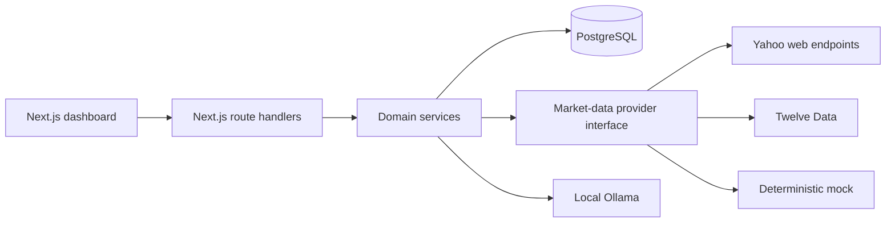

# MarketPulse: Product and Architecture Decisions

This is the living decision record for development, evaluation, demos, and interviews. It explains what was chosen, why, the trade-offs, and whether each capability is implemented or planned.

## Product interpretation

The product is not merely a table of stock prices. Its central question is:

> What has meaningfully changed since this user last reviewed the watchlist, and what deserves attention now?

MarketPulse therefore separates:

- **Latest market information:** the newest accepted quote stored for each instrument.
- **Since your last review:** an immutable comparison between two review snapshots.

Those values can legitimately differ when a newer quote arrives after a review was created.

## Terminology

- **Watchlist:** a user-owned, named collection such as `Banking Stocks` or `Long-term Picks`. A user may own multiple watchlists.
- **Instrument:** an exchange-aware market entity. `symbol + exchange + instrument type` forms its business identity because a ticker alone is not globally unique.
- **Quote:** one provider observation containing price, provider time, receipt time, source, quality, session, and optional OHLC/volume.
- **Review:** a frozen watchlist snapshot. An acknowledged review becomes a future baseline.
- **Meaningful change:** a deterministic assessment between a current review and its acknowledged baseline—not simply today's percentage.

## Current architecture

Status labels in this document:

- **Implemented:** present and verified.
- **Partial:** foundation exists but production behavior is incomplete.
- **Planned:** intentionally designed but not implemented yet.

## Decision log

### ADR-001: Begin with a modular monolith

**Status:** Implemented

Frontend, API routes, services, and repositories live in one Next.js project. PostgreSQL and Ollama are separate runtime dependencies.

**Why:** the domain is evolving; one deployable unit is simple to run and demonstrate; database transactions stay straightforward. Module boundaries still allow market ingestion or notifications to become separate workers later.

### ADR-002: Keep durable state in PostgreSQL

**Status:** Implemented

PostgreSQL stores users, watchlists, memberships, instruments, quotes, latest quotes, and reviews.

**Why:** state survives restarts, works across future authenticated devices, supports transactions and foreign keys, and makes historical comparison reproducible. Browser local storage is device-specific and is not an integrity-safe source of truth.

### ADR-003: Separate watchlists, memberships, and instruments

**Status:** Implemented

`WatchlistItem` models the many-to-many membership. One instrument may appear in many watchlists, while notes, ordering, and custom thresholds belong to the membership.

**Why:** market observations can be shared. If INFY appears in 1,000 watchlists, it should be fetched once per refresh cycle—not 1,000 times.

### ADR-004: Use exchange-aware identity

**Status:** Implemented for NSE/BSE equities

Instrument uniqueness is based on exchange, symbol, and instrument type. Yahoo identifiers such as `.NS` and `.BO` are provider mappings, not primary identity.

**Scale path:** add a provider-symbol mapping table when multiple providers or international instruments require different identifiers for the same entity.

### ADR-005: Search locally first and persist only after selection

**Status:** Implemented

Search checks PostgreSQL and uses Yahoo discovery when more results are needed. A search does not write remote results to the database.

**Why:** GET requests should remain read-only, and saving every search result would pollute the catalogue. When the user clicks Add, the backend revalidates the Yahoo identifier, upserts the instrument, and creates the membership. Browser-supplied company metadata is not trusted.

### ADR-006: Hide providers behind an interface

**Status:** Implemented

The domain consumes one internal quote shape through a provider interface. Mock, Twelve Data, and Yahoo adapters normalize their responses.

**Why:** providers differ in authentication, limits, symbol formats, data fields, and failure modes. A licensed provider can later replace Yahoo without rewriting reviews and watchlists.

### ADR-007: Treat Yahoo as best-effort

**Status:** Implemented

Yahoo is useful for a free local demonstration but the integration uses undocumented web endpoints, not a supported developer API. The source is recorded as `yahoo-finance-unofficial`.

Yahoo currently documents NSE `.NS` as real-time and BSE `.BO` as 15-minute delayed. Even so, this application cannot promise licensed, contractual, or continuously available real-time delivery. Production requires a licensed provider with authentication, rate limits, redistribution rights, and a service guarantee.

### ADR-008: Separate source, market session, quality, and freshness

**Status:** Implemented

Every accepted observation records provider source, provider timestamp, receipt timestamp, market session, and quality. `MARKET_CLOSED` means an older last-traded price is expected; `DELAYED` describes provider quality. They are shown separately rather than collapsed into one ambiguous label.

### ADR-009: Do not fetch Yahoo on every page load

**Status:** Implemented for reads, local scheduling, and browser polling

The dashboard reads `LatestQuote` from PostgreSQL instead of synchronously calling Yahoo.

**Why:**

- Ten viewers should not trigger ten identical upstream requests.
- Large watchlists would create slow request fan-out.
- Provider throttling would directly break page rendering.
- Provider traffic should follow unique instruments, not page views.
- The dashboard should remain usable during an upstream outage.

Current refresh triggers are the manual `market:refresh` command, a best-effort first fetch after adding a discovered instrument, and the separate local `market:worker` process.

Current local MVP behavior:

1. A separate backend worker checks unique watched instruments every five minutes and refreshes during regular weekday market hours.
2. It prevents overlapping cycles, survives provider failures, and shuts down gracefully.
3. It skips weekends and times outside 09:15–15:30 in `Asia/Kolkata`.

The browser rereads PostgreSQL every 60 seconds while its tab is visible and also offers a manual **Refresh displayed data** control. This control deliberately does not call Yahoo. Polling does not remount the instrument-search component, so background updates cannot erase user input. Exchange-holiday awareness remains planned; an unchanged holiday quote is currently handled safely by idempotent storage.

These are distinct operations: the worker updates PostgreSQL; the browser reads PostgreSQL. Page reload alone does not currently contact Yahoo.

### ADR-010: Validate provider responses before storage

**Status:** Implemented

The ingestion service accepts only requested instrument IDs, valid positive prices, and valid timestamps. Unexpected, duplicate, or malformed observations are rejected.

**Why:** an external HTTP 200 response is not proof of semantically valid financial data.

### ADR-011: Keep history and a latest projection

**Status:** Implemented

`Quote` stores observations for history and charts. `LatestQuote` stores one fast dashboard row per instrument.

Unique `instrument + source + provider timestamp` makes ingestion idempotent. Older quotes do not replace newer latest quotes. External observations may replace a mock latest value, and metadata for the same observation may be improved without creating duplicate history.

### ADR-012: Freeze review snapshots

**Status:** Implemented

Reviews capture the quote facts available at creation time and are never rewritten by a later refresh.

**Why:** the user needs a stable record; attention results and AI explanations must not silently change; acknowledgement must refer to a specific version; debugging must be reproducible.

A new instrument without a baseline is `NOT ASSESSED`, never compared against an invented zero.

### ADR-013: Preserve and enforce provenance

**Status:** Implemented for new reviews

Snapshot items include quote source. Source families determine compatibility:

- Yahoo → Yahoo: comparable.
- mock-baseline → mock-moved: comparable for deterministic demos.
- mock → Yahoo: not assessed.
- unknown legacy source → Yahoo: not assessed.

**Why:** a fabricated mock value followed by a real provider value is not proof of market movement. Uncertainty is surfaced instead of hidden.

### ADR-014: Use deterministic, versioned change rules

**Status:** Implemented V1 and first V2 context upgrade; historical signals planned

Threshold logic is deterministic and its policy version is saved with each review.

**Why:** identical inputs produce identical output; boundary behavior can be tested; historical results remain explainable when rules evolve; AI cannot redefine significance.

Raw cumulative volume is not treated as meaningful by itself because observations at different times of day are not directly comparable.

`price-context-v2` freezes a watchlist item's custom price threshold into the immutable snapshot, derives medium/high bands at 2x/4x, reports the applied bands, adds explicit confidence, and identifies a material current-session reversal from the frozen previous close.

`historical-context-v3` additionally freezes up to 30 prior trading-day observations from the same provider family. It keeps the final stored observation per India-market date, requires at least 10 days for a recent range and median volume, and at least 11 prices/10 returns for sample volatility. A 0.25% volatility floor limits division-by-near-zero amplification. Breakouts require the absolute user threshold too; volatility can only elevate a movement that already passes that threshold.

Volume is considered only for a `CLOSED` session and is compared with the median—not mean—of at least 10 prior daily observations. This avoids comparing partial intraday cumulative volume with completed days and reduces sensitivity to isolated volume spikes. Existing reviews retain their original V1 or V2 semantics through the policy registry.

Raw cumulative volume remains excluded because two snapshots captured at different times of day are not comparable. Planned signals include volatility-adjusted price change, time-aligned abnormal volume, price gaps, recent-range breakouts, and verified events. Each will require enough normalized historical observations and will decline to assess when evidence is insufficient.

### ADR-015: Prefer “not assessed” over false precision

**Status:** Implemented

Missing/invalid prices, stale or conflicted blocking data, missing provenance, incompatible sources, and absent baselines produce no percentage and no attention claim.

In financial software, a visible limitation is safer than a precise-looking result from incomparable facts.

### ADR-016: AI explains; it does not decide

**Status:** Implemented locally with Ollama

The deterministic engine supplies verified symbols, percentages, reasons, warnings, sources, and attention levels. Ollama generates only a concise explanation from those facts.

AI must not calculate the authoritative percentage, invent causes/news, predict prices, give investment advice, or override a blocked comparison. Structured output is validated and a deterministic template remains available when Ollama fails.

Generated text is also checked against the fact set: every stated percentage must exactly match a verified comparison, high-attention instruments must appear with their verified percentage, highlights must identify a known symbol, and unavailable instruments cannot be assigned low/medium/high attention. Thus `null` can never be rewritten as `0%`; any violation activates the deterministic fallback.

### ADR-017: Charts provide context, not causation

**Status:** Implemented

Historical charts show stored observations plus baseline/current-review markers. They explain timing and magnitude, but do not claim why a movement occurred.

### ADR-018: Isolate dependency failure

**Status:** Implemented

Discovery returns `AVAILABLE`, `UNAVAILABLE`, or `SKIPPED`. HTTP failure, 429, timeout, invalid JSON, and invalid response shape no longer look like a genuine empty search. PostgreSQL results remain usable while Yahoo is unavailable.

An initial quote fetch is best-effort: provider failure does not undo an already committed membership or mislead the user into retrying a successful add.

### ADR-019: Protect concurrent mutations

**Status:** Implemented

Optimistic version fields prevent stale tabs from silently overwriting watchlists or review acknowledgement. Database uniqueness is the final defense against duplicate names, memberships, quotes, and snapshots. Serializable review creation retries transient conflicts.

### ADR-020: Add caching deliberately

**Status:** Implemented for discovery; PostgreSQL remains authoritative

Redis caches successful Yahoo discovery results and coordinates distributed refresh leases. It may later cache latest-quote responses and shared provider circuit-breaker state.

Suggested starting TTLs:

- latest responses during market hours: 30–60 seconds;
- discovery results: 5–15 minutes;
- negative discovery results: shorter;
- closed-market values: until the next expected session, with a safety cap.

Positive discovery results use a ten-minute TTL. Genuine empty results use a one-minute TTL so a temporary catalog delay does not hide instruments for long. Provider outages are never cached as empty results. Local PostgreSQL results are always queried first and override duplicates from cached discovery, so importing an instrument does not require invalidating search caches.

Cache entries are disposable, and every cache operation fails open to the PostgreSQL/provider path. Redis never contains the authoritative watchlist, review, instrument, or quote record.

### ADR-021: Enforce ownership server-side

**Status:** Implemented for the current credentials-based scope

Auth.js configuration, password hashing, validated registration, normalized email identity, database uniqueness, dedicated registration/login pages, logout, protected dashboard rendering, and authenticated API identity are implemented. Registration returns only safe user fields and never returns a password hash. A successful registration immediately attempts a credentials sign-in.

The server—not a browser-supplied user ID—determines ownership. Existing service queries scope watchlists and reviews by the authenticated database user. The seeded demo records remain isolated under their original user rather than being copied into new accounts. Session-expiry UX, password recovery, email verification, login rate limiting, and broader ownership integration tests remain production-hardening work.

### ADR-022: Run scheduled ingestion outside the web process

**Status:** Implemented locally with a Redis lease; production scheduling planned

An in-process production timer is unsafe because web instances restart and horizontally scaled instances can run the same timer simultaneously.

The local `market:worker` is a separate long-running process. It uses a configurable interval with a safe minimum, prevents overlapping work, logs outcomes, skips known closed periods, catches failures without exiting, and disconnects from PostgreSQL and Redis during graceful shutdown. A renewable Redis lease prevents multiple worker instances from refreshing simultaneously. Lease release checks a random ownership token, preventing an expired worker from deleting a successor's lease.

For the current best-effort data source, Redis failure degrades to local execution because quote writes are idempotent and application availability is more valuable than strict single execution. A licensed provider with hard quotas may instead require fail-closed scheduling during coordination outages.

Production evolution:

- local: separate scheduled command/worker;
- deployment: platform cron invoking a protected job;
- larger scale: scheduler → queue → bounded workers.

Jobs must be idempotent, retryable with exponential backoff and jitter, observable, quota-aware, and guarded by a lease/distributed lock.

### ADR-023: Scale provider work by unique instruments

**Status:** Partial

The refresh query already selects unique actively watched instruments. At greater scale:

- batch according to provider limits;
- partition bounded jobs;
- enforce concurrency and quotas per provider;
- cache shared latest values;
- use circuit breakers and retry budgets;
- partition or downsample old quote history;
- use read replicas for history-heavy traffic;
- monitor quote age and ingestion lag.

### ADR-024: Bound provider failures with retry budgets and a circuit breaker

**Status:** Implemented in-process for Yahoo

Yahoo requests use an eight-second timeout per attempt and at most three attempts. Only network failures and plausibly temporary HTTP responses (`408`, `425`, `429`, and selected `5xx` statuses) consume the retry budget. Permanent client responses such as `400` or `404` return immediately because retrying them wastes quota and delays the user without changing the outcome.

Retries use capped exponential backoff with full jitter so multiple workers do not synchronize into a retry storm. A failed request cycle counts once toward the circuit breaker, rather than counting every internal attempt. After five consecutive failed cycles, the process-local circuit opens for 30 seconds. During that interval calls fail fast; after it, one half-open probe decides whether normal traffic can resume.

This circuit state is intentionally process-local for the current single-worker deployment. A production system with multiple workers should move circuit state and refresh leases into Redis so every instance shares the same provider-health view. Provider failure still degrades to stored PostgreSQL data or an explicit unavailable state; it never deletes the last valid observation.

## Edge-case policy

| Situation | Behavior |
|---|---|
| Provider timeout/429 during discovery | Show provider unavailable; retain local results |
| Genuine empty provider search | Show no matching instruments |
| Duplicate or concurrent add | Keep one membership; return conflict for the loser |
| Initial quote fetch fails | Keep membership; show unavailable until refresh |
| Unexpected instrument or invalid price | Reject provider observation |
| Older quote arrives late | Never replace a newer latest quote |
| Same observation repeats | Idempotent storage |
| Market closed | Keep last valid observation and label closed |
| Newly added instrument | Not assessed until a baseline exists |
| Mock and real sources meet | Not assessed |
| Legacy source is unknown | Not assessed |
| Ollama fails or returns invalid output | Deterministic fallback |
| Stale tab acknowledges | Version conflict |
| Instrument removed after review | Preserve historical review |

## Security and integrity

- Validate route inputs with Zod.
- Revalidate provider identifiers server-side.
- Keep API keys server-side and never commit `.env`.
- Use Prisma parameterization and database constraints.
- Enforce user ownership in every scoped operation.
- Rate-limit discovery, reviews, and AI before public deployment.
- Protect scheduler endpoints with a secret or platform identity.
- Treat provider content and AI output as untrusted.

## Production observability

Measure quote attempts/successes/rejections, provider latency/status, latest-quote age, freshness distribution, scheduler lag, discovery availability, AI fallback rate, transaction conflicts, and review failures. Logs should contain provider, instrument identifier, run ID, and error category—but never credentials or sensitive user data.

**Implemented baseline:** every manual or scheduled refresh receives a UUID run ID and emits structured JSON for completion, skip, or failure. Completion includes provider duration, total duration, requested/received/accepted/rejected counts, categorized rejection counts, storage outcomes, and lease coordination mode. Errors are reduced to name and message; secrets, connection strings, request headers, and user records are excluded.

`GET /api/health` is an uncached, sanitized readiness view. PostgreSQL failure returns HTTP 503 and `unhealthy`; configured-but-unavailable Redis returns HTTP 200 with `degraded` because cache/coordination currently fail open. It also reports the Yahoo circuit state and latest stored quote age. Quote age is diagnostic rather than readiness because closed markets legitimately have old observations.

## Testing strategy

### V4 audit correction

New reviews use `observed-context-v4`. PostgreSQL selects the final eligible observation per instrument/source/India date within a 90-calendar-day window before loading rows; the most recent 30 prior dates form the observed-price range. This removes the 200-raw-quote cutoff. These are sampled prices, not certified OHLC bars. V4 does not compute or score daily volatility or completed-session abnormal volume from this dataset, even if legacy reference values are passed in. Provider daily bars and matched-horizon returns remain deferred. Existing V3 snapshots are preserved, and the UI labels their methodology limitations. Earlier statements that all historical features were production complete are superseded by this section.

### ADR-025: Store completed daily candles separately from quote observations

**Status:** Storage, Yahoo ingestion, validation, idempotent backfill, and versioned V5 integration implemented

`quotes` records what the application observed at a moment in time. It is appropriate for the latest-price table and review snapshots, but the last observation stored on a date is not necessarily that session's official close or full-session volume. A separate `daily_price_bars` table therefore stores provider daily OHLCV candles keyed by instrument, source, and exchange trading date.

The Yahoo backfill requests daily candles, converts timestamps using each instrument's exchange timezone, and always excludes the current exchange date. It rejects missing/non-positive prices, unsafe or negative volume, and internally contradictory OHLC ranges. Repeated jobs upsert the same natural key so provider corrections are accepted without creating duplicates. Raw OHLC is retained; an adjusted close is stored separately and the adjustment representation is explicit. Raw and adjusted series must never be mixed silently.

Every row preserves provider source, provider timestamp, receipt time, and trading date. The source remains `yahoo-finance-unofficial`: structural validation and completed-date filtering do not make an unofficial candle exchange-certified. Missing dates stay missing rather than being manufactured because holidays, suspensions, provider gaps, and listing changes cannot safely be distinguished using weekday arithmetic.

Run `npm run market:history` as a daily backfill after the market session. It works on unique actively watched instruments and stays separate from the five-minute quote worker, avoiding a three-month history request on every quote refresh. At larger scale this becomes a bounded, provider-quota-aware queue job.

V4 continues to decline volatility and abnormal-volume scoring. New V5 snapshots consume these rows using the safeguards in ADR-027; old reviews retain their original policy semantics.

### ADR-027: Use completed daily evidence through a versioned V5 policy

**Status:** Implemented for new reviews

`daily-context-v5` is the current policy. It freezes daily-history provenance, price basis, sample counts, recent range, median volume, review-horizon session count, and horizon-adjusted volatility into every new review snapshot. Later backfills cannot rewrite an existing review's result.

Volatility uses at least 11 daily bars and 10 adjusted-close returns. Daily standard deviation is scaled by the square root of completed sessions since the acknowledged baseline, so a multi-session review movement is not compared directly with a one-day volatility value. A same-session comparison conservatively uses one session. If the baseline predates the oldest available bar, horizon coverage is incomplete and volatility is withheld.

Recent-range breakouts use raw daily highs and lows from at least 10 completed dates. They are withheld when the adjusted-close/raw-close factor changes by more than 1% inside the window, because that suggests a corporate-action or other price-basis discontinuity. Completed-session volume uses the median of at least 10 daily bars and is evaluated only when the current quote reports `CLOSED`. Historical context never bypasses the user's minimum movement threshold.

Daily bars must belong to the current quote's provider family and must have been received before the snapshot time. Yahoo data remains explicitly unofficial: “validated completed daily evidence” means structurally checked and not from the current exchange date, not exchange-certified or guaranteed complete. A licensed feed would strengthen provenance without changing the policy boundary.

V1–V4 remain registered for deterministic replay. V3 preserves its legacy behavior, V4 preserves its conservative refusal of unsupported historical scoring, and only new V5 snapshots use the daily context.

### ADR-026: Use attention-first progressive disclosure

**Status:** Implemented

The review and current-market table answer different questions. The review answers “what changed since I last checked and deserves attention?” The market table answers “what is the latest stored price and today's movement?” Both remain because removing either would lose a core requirement, but they no longer receive equal visual weight or repeat all details.

The review initially shows only instruments that crossed a meaningful-movement level, plus a clear calm state when none did. Below-threshold and unassessable comparisons are grouped behind “other comparisons.” Each result exposes one plain-language reason; confidence, thresholds, provenance, methodology notes, data limitations, and review markers live behind “Why this result?” AI explanation is optional and collapsed by default.

The latest-price table keeps symbol, price, today's movement, and availability visible. Volume, provider provenance, charts, and removal controls are secondary details. Instrument search opens only when requested, custom thresholds are labeled advanced, and rename/delete controls are grouped as watchlist settings.

This is progressive disclosure, not removal: expert and evaluator evidence remains reachable, while a first-time user can understand the default screen without learning the internal policy model. Native buttons, `details`/`summary`, headings, status regions, and expanded-state attributes preserve keyboard and assistive-technology behavior.

### Correctness audit — outstanding limitations

Earlier completion labels describe implemented features, not production certification. V3 historical scoring retains known methodological weaknesses for reproducibility, while V4 refuses its unsupported volatility and volume claims. V5 now uses separately stored completed-date candles, adjusted-close return continuity, review-horizon scaling, provider compatibility, and immutable snapshot references. Yahoo remains unofficial, exchange-calendar completeness is not independently certified, and corporate-action handling is deliberately conservative rather than comprehensive.

AI percentage attribution now requires each percentage-bearing sentence/highlight to identify exactly one fact and match that instrument's signed percentage. Unavailable instruments cannot borrow another instrument's zero. Ambiguous same-symbol exchange listings and multi-instrument numerical sentences trigger deterministic fallback. Regression tests cover these cases. This conservative check does not prove all natural-language statements or causal claims correct; further structured-output validation remains.

Browser coverage uses Playwright/Chromium against the production build on port 3100. Run `npm run build` followed by `npm run test:e2e` with local PostgreSQL running. The test creates unique temporary accounts and a catalog instrument, checks registration, watchlist persistence, custom-threshold storage, review acknowledgement, cross-user HTTP isolation and logout, then deletes only its own fixtures. Search responses are stubbed for repeatability; this does not verify live Yahoo discovery. Real session cookies, API writes and PostgreSQL are exercised. Failure traces are local ignored artifacts and can contain test-session information. This baseline does not yet cover all chart, provider-failure or multi-tab races.

Current automated coverage includes authentication guards, PostgreSQL-backed cross-user watchlist and review isolation, threshold boundaries, negative movement, invalid prices, missing baselines, stale/conflicted/delayed/closed data, provenance compatibility, warning deduplication, Yahoo normalization and deduplication, genuine empty searches, HTTP errors, malformed responses, and network failures. Database-backed checks live in a separate `test:integration` command so the fast unit suite does not unexpectedly require PostgreSQL.

Next coverage should include HTTP-level session/cookie authorization, repository concurrency, scheduler locking, cache invalidation, provider retries, and end-to-end browser flows.

## Roadmap

1. **Completed:** watchlists, persistence, quotes, immutable reviews, deterministic change detection, charts, provenance, and local AI explanation.
2. **Completed:** local-first Yahoo discovery, secure import, first quote, and outage-aware search.
3. **Completed:** local scheduled refresh, visible-tab browser polling, and manual display refresh.
4. **Completed for MVP:** credentials registration/login, authenticated ownership, protected dashboard, logout, authentication-guard tests, and PostgreSQL-backed cross-user ownership tests. HTTP cookie/session flows and session-expiry UX remain hardening work.
5. **Completed locally:** bounded Yahoo timeouts, retry budgets with exponential backoff and jitter, and an in-process circuit breaker.
6. **Completed:** Redis discovery caching and distributed refresh locks with graceful degradation.
7. **Completed with explicit limits:** V5 integrates validated completed-date daily OHLCV into immutable, horizon-aware historical context. V1–V4 remain replayable; Yahoo is still unofficial.
8. **In progress:** daily-history backfill is automated with durable per-instrument checkpoints, bounded batches, retry backoff, retention, and a distributed lease. Browser coverage for V5 signal presentation remains.

The dashboard exposes the policy version, confidence, exact applied low/medium/high thresholds, verified signal labels, and historical sample availability. Custom thresholds are configured per watchlist membership during instrument addition and are frozen into reviews; later UI changes cannot rewrite past review meaning. AI receives the same verified V5 fields and may describe only signal identifiers supplied by deterministic code.
9. **Before production:** licensed provider decision, deployment, security review, retention policy, monitoring, and load tests.

### ADR-028: Maintain completed daily history as an independent background concern

**Status:** Implemented

Daily history is not fetched during a dashboard request. The market worker checks for history work at startup and every 15 minutes, while PostgreSQL checkpoints decide which instruments are actually due. A newly watched instrument has no checkpoint and is therefore backfilled on the next check. An existing instrument is eligible only when its checkpoint is behind the latest completed exchange date. Unsuccessful instruments retry after a one-hour backoff rather than on every worker tick.

History work uses a Redis lease separate from the live-quote lease, so horizontally scaled workers do not download the same history concurrently. PostgreSQL remains the durable source of completion state; Redis is coordination rather than correctness storage. If Redis is unavailable, idempotent database upserts preserve data integrity, although duplicate provider work can occur across processes during that degraded period.

The provider is called in bounded batches of 20 instruments. Bars are unique by instrument, source and trading date, so retries and overlapping three-month provider windows are safe. A checkpoint advances only when at least one valid bar is returned for that instrument; empty or failed responses remain retryable. The target date becomes the current weekday only after 16:00 IST, leaving a buffer after the regular close; before then and on weekends it is the previous weekday. Exchange holidays are not inferred locally: a successful provider response can checkpoint the attempted completed date without inventing a candle.

Daily bars older than 730 days are removed after a cycle that performs provider work. V5 reads only a recent bounded window, so this keeps storage growth predictable while retaining far more context than the scoring policy currently needs. Daily data is already compact and is not downsampled; downsampling would lose real trading-session observations and is reserved for future intraday data. All intervals, batch size, retry delay and retention are bounded environment settings.

## Evaluator-ready explanation

MarketPulse does not make each page view responsible for obtaining market data. A provider-independent ingestion path validates and stores shared observations once per unique watched instrument. The dashboard reads predictable local state, while immutable snapshots compare what the user sees now with what they last acknowledged. Provenance, freshness, session, and quality travel with the snapshots, allowing the system to refuse misleading comparisons. Deterministic versioned rules decide significance; AI only explains verified results. This keeps the MVP understandable while retaining clear paths to workers, caching, authentication, licensed data, and horizontal scale.
