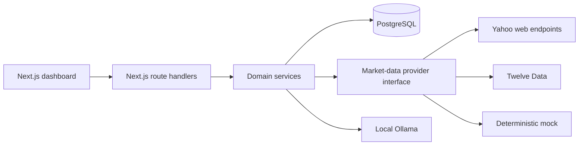

# MarketPulse: Product and Architecture Decisions

This is the living decision record for development, evaluation, demos, and interviews. It explains what was chosen, why, the trade-offs, and whether each capability is implemented or planned.

## Product interpretation

The product is not merely a table of stock prices. Its central question is:

> What has meaningfully changed since this user last reviewed the watchlist, and what deserves attention now?

MarketPulse therefore separates:

- **Latest market information:** the newest accepted quote stored for each instrument.
- **Since your last review:** an immutable comparison between two review snapshots.

Those values can legitimately differ when a newer quote arrives after a review was created.

## Terminology

- **Watchlist:** a user-owned, named collection such as `Banking Stocks` or `Long-term Picks`. A user may own multiple watchlists.
- **Instrument:** an exchange-aware market entity. `symbol + exchange + instrument type` forms its business identity because a ticker alone is not globally unique.
- **Quote:** one provider observation containing price, provider time, receipt time, source, quality, session, and optional OHLC/volume.
- **Review:** a frozen watchlist snapshot. An acknowledged review becomes a future baseline.
- **Meaningful change:** a deterministic assessment between a current review and its acknowledged baseline—not simply today's percentage.

## Current architecture

Status labels in this document:

- **Implemented:** present and verified.
- **Partial:** foundation exists but production behavior is incomplete.
- **Planned:** intentionally designed but not implemented yet.

## Decision log

### ADR-001: Begin with a modular monolith

**Status:** Implemented

Frontend, API routes, services, and repositories live in one Next.js project. PostgreSQL and Ollama are separate runtime dependencies.

**Why:** the domain is evolving; one deployable unit is simple to run and demonstrate; database transactions stay straightforward. Module boundaries still allow market ingestion or notifications to become separate workers later.

### ADR-002: Keep durable state in PostgreSQL

**Status:** Implemented

PostgreSQL stores users, watchlists, memberships, instruments, quotes, latest quotes, and reviews.

**Why:** state survives restarts, works across future authenticated devices, supports transactions and foreign keys, and makes historical comparison reproducible. Browser local storage is device-specific and is not an integrity-safe source of truth.

### ADR-003: Separate watchlists, memberships, and instruments

**Status:** Implemented

`WatchlistItem` models the many-to-many membership. One instrument may appear in many watchlists, while notes, ordering, and custom thresholds belong to the membership.

**Why:** market observations can be shared. If INFY appears in 1,000 watchlists, it should be fetched once per refresh cycle—not 1,000 times.

### ADR-004: Use exchange-aware identity

**Status:** Implemented for NSE/BSE equities

Instrument uniqueness is based on exchange, symbol, and instrument type. Yahoo identifiers such as `.NS` and `.BO` are provider mappings, not primary identity.

**Scale path:** add a provider-symbol mapping table when multiple providers or international instruments require different identifiers for the same entity.

### ADR-005: Search locally first and persist only after selection

**Status:** Implemented

Search checks PostgreSQL and uses Yahoo discovery when more results are needed. A search does not write remote results to the database.

**Why:** GET requests should remain read-only, and saving every search result would pollute the catalogue. When the user clicks Add, the backend revalidates the Yahoo identifier, upserts the instrument, and creates the membership. Browser-supplied company metadata is not trusted.

### ADR-006: Hide providers behind an interface

**Status:** Implemented

The domain consumes one internal quote shape through a provider interface. Mock, Twelve Data, and Yahoo adapters normalize their responses.

**Why:** providers differ in authentication, limits, symbol formats, data fields, and failure modes. A licensed provider can later replace Yahoo without rewriting reviews and watchlists.

### ADR-007: Treat Yahoo as best-effort

**Status:** Implemented

Yahoo is useful for a free local demonstration but the integration uses undocumented web endpoints, not a supported developer API. The source is recorded as `yahoo-finance-unofficial`.

Yahoo currently documents NSE `.NS` as real-time and BSE `.BO` as 15-minute delayed. Even so, this application cannot promise licensed, contractual, or continuously available real-time delivery. Production requires a licensed provider with authentication, rate limits, redistribution rights, and a service guarantee.

### ADR-008: Separate source, market session, quality, and freshness

**Status:** Implemented

Every accepted observation records provider source, provider timestamp, receipt timestamp, market session, and quality. `MARKET_CLOSED` means an older last-traded price is expected; `DELAYED` describes provider quality. They are shown separately rather than collapsed into one ambiguous label.

### ADR-009: Do not fetch Yahoo on every page load

**Status:** Implemented for reads, local scheduling, and browser polling

The dashboard reads `LatestQuote` from PostgreSQL instead of synchronously calling Yahoo.

**Why:**

- Ten viewers should not trigger ten identical upstream requests.
- Large watchlists would create slow request fan-out.
- Provider throttling would directly break page rendering.
- Provider traffic should follow unique instruments, not page views.
- The dashboard should remain usable during an upstream outage.

Current refresh triggers are the manual `market:refresh` command, a best-effort first fetch after adding a discovered instrument, and the separate local `market:worker` process.

Current local MVP behavior:

1. A separate backend worker checks unique watched instruments every five minutes and refreshes during regular weekday market hours.
2. It prevents overlapping cycles, survives provider failures, and shuts down gracefully.
3. It skips weekends and times outside 09:15–15:30 in `Asia/Kolkata`.

The browser rereads PostgreSQL every 60 seconds while its tab is visible and also offers a manual **Refresh displayed data** control. This control deliberately does not call Yahoo. Polling does not remount the instrument-search component, so background updates cannot erase user input. Exchange-holiday awareness remains planned; an unchanged holiday quote is currently handled safely by idempotent storage.

These are distinct operations: the worker updates PostgreSQL; the browser reads PostgreSQL. Page reload alone does not currently contact Yahoo.

### ADR-010: Validate provider responses before storage

**Status:** Implemented

The ingestion service accepts only requested instrument IDs, valid positive prices, and valid timestamps. Unexpected, duplicate, or malformed observations are rejected.

**Why:** an external HTTP 200 response is not proof of semantically valid financial data.

### ADR-011: Keep history and a latest projection

**Status:** Implemented

`Quote` stores observations for history and charts. `LatestQuote` stores one fast dashboard row per instrument.

Unique `instrument + source + provider timestamp` makes ingestion idempotent. Older quotes do not replace newer latest quotes. External observations may replace a mock latest value, and metadata for the same observation may be improved without creating duplicate history.

### ADR-012: Freeze review snapshots

**Status:** Implemented

Reviews capture the quote facts available at creation time and are never rewritten by a later refresh.

**Why:** the user needs a stable record; attention results and AI explanations must not silently change; acknowledgement must refer to a specific version; debugging must be reproducible.

A new instrument without a baseline is `NOT ASSESSED`, never compared against an invented zero.

### ADR-013: Preserve and enforce provenance

**Status:** Implemented for new reviews

Snapshot items include quote source. Source families determine compatibility:

- Yahoo → Yahoo: comparable.
- mock-baseline → mock-moved: comparable for deterministic demos.
- mock → Yahoo: not assessed.
- unknown legacy source → Yahoo: not assessed.

**Why:** a fabricated mock value followed by a real provider value is not proof of market movement. Uncertainty is surfaced instead of hidden.

### ADR-014: Use deterministic, versioned change rules

**Status:** Implemented MVP; richer rules planned

Threshold logic is deterministic and its policy version is saved with each review.

**Why:** identical inputs produce identical output; boundary behavior can be tested; historical results remain explainable when rules evolve; AI cannot redefine significance.

Raw cumulative volume is not treated as meaningful by itself because observations at different times of day are not directly comparable.

Planned signals include volatility-adjusted price change, time-aligned abnormal volume, price gaps, recent-range breakouts, verified events, and user-specific thresholds.

### ADR-015: Prefer “not assessed” over false precision

**Status:** Implemented

Missing/invalid prices, stale or conflicted blocking data, missing provenance, incompatible sources, and absent baselines produce no percentage and no attention claim.

In financial software, a visible limitation is safer than a precise-looking result from incomparable facts.

### ADR-016: AI explains; it does not decide

**Status:** Implemented locally with Ollama

The deterministic engine supplies verified symbols, percentages, reasons, warnings, sources, and attention levels. Ollama generates only a concise explanation from those facts.

AI must not calculate the authoritative percentage, invent causes/news, predict prices, give investment advice, or override a blocked comparison. Structured output is validated and a deterministic template remains available when Ollama fails.

### ADR-017: Charts provide context, not causation

**Status:** Implemented

Historical charts show stored observations plus baseline/current-review markers. They explain timing and magnitude, but do not claim why a movement occurred.

### ADR-018: Isolate dependency failure

**Status:** Implemented

Discovery returns `AVAILABLE`, `UNAVAILABLE`, or `SKIPPED`. HTTP failure, 429, timeout, invalid JSON, and invalid response shape no longer look like a genuine empty search. PostgreSQL results remain usable while Yahoo is unavailable.

An initial quote fetch is best-effort: provider failure does not undo an already committed membership or mislead the user into retrying a successful add.

### ADR-019: Protect concurrent mutations

**Status:** Implemented

Optimistic version fields prevent stale tabs from silently overwriting watchlists or review acknowledgement. Database uniqueness is the final defense against duplicate names, memberships, quotes, and snapshots. Serializable review creation retries transient conflicts.

### ADR-020: Add caching deliberately

**Status:** Implemented for discovery; PostgreSQL remains authoritative

Redis caches successful Yahoo discovery results and coordinates distributed refresh leases. It may later cache latest-quote responses and shared provider circuit-breaker state.

Suggested starting TTLs:

- latest responses during market hours: 30–60 seconds;
- discovery results: 5–15 minutes;
- negative discovery results: shorter;
- closed-market values: until the next expected session, with a safety cap.

Positive discovery results use a ten-minute TTL. Genuine empty results use a one-minute TTL so a temporary catalog delay does not hide instruments for long. Provider outages are never cached as empty results. Local PostgreSQL results are always queried first and override duplicates from cached discovery, so importing an instrument does not require invalidating search caches.

Cache entries are disposable, and every cache operation fails open to the PostgreSQL/provider path. Redis never contains the authoritative watchlist, review, instrument, or quote record.

### ADR-021: Enforce ownership server-side

**Status:** Implemented for the current credentials-based scope

Auth.js configuration, password hashing, validated registration, normalized email identity, database uniqueness, dedicated registration/login pages, logout, protected dashboard rendering, and authenticated API identity are implemented. Registration returns only safe user fields and never returns a password hash. A successful registration immediately attempts a credentials sign-in.

The server—not a browser-supplied user ID—determines ownership. Existing service queries scope watchlists and reviews by the authenticated database user. The seeded demo records remain isolated under their original user rather than being copied into new accounts. Session-expiry UX, password recovery, email verification, login rate limiting, and broader ownership integration tests remain production-hardening work.

### ADR-022: Run scheduled ingestion outside the web process

**Status:** Implemented locally with a Redis lease; production scheduling planned

An in-process production timer is unsafe because web instances restart and horizontally scaled instances can run the same timer simultaneously.

The local `market:worker` is a separate long-running process. It uses a configurable interval with a safe minimum, prevents overlapping work, logs outcomes, skips known closed periods, catches failures without exiting, and disconnects from PostgreSQL and Redis during graceful shutdown. A renewable Redis lease prevents multiple worker instances from refreshing simultaneously. Lease release checks a random ownership token, preventing an expired worker from deleting a successor's lease.

For the current best-effort data source, Redis failure degrades to local execution because quote writes are idempotent and application availability is more valuable than strict single execution. A licensed provider with hard quotas may instead require fail-closed scheduling during coordination outages.

Production evolution:

- local: separate scheduled command/worker;
- deployment: platform cron invoking a protected job;
- larger scale: scheduler → queue → bounded workers.

Jobs must be idempotent, retryable with exponential backoff and jitter, observable, quota-aware, and guarded by a lease/distributed lock.

### ADR-023: Scale provider work by unique instruments

**Status:** Partial

The refresh query already selects unique actively watched instruments. At greater scale:

- batch according to provider limits;
- partition bounded jobs;
- enforce concurrency and quotas per provider;
- cache shared latest values;
- use circuit breakers and retry budgets;
- partition or downsample old quote history;
- use read replicas for history-heavy traffic;
- monitor quote age and ingestion lag.

### ADR-024: Bound provider failures with retry budgets and a circuit breaker

**Status:** Implemented in-process for Yahoo

Yahoo requests use an eight-second timeout per attempt and at most three attempts. Only network failures and plausibly temporary HTTP responses (`408`, `425`, `429`, and selected `5xx` statuses) consume the retry budget. Permanent client responses such as `400` or `404` return immediately because retrying them wastes quota and delays the user without changing the outcome.

Retries use capped exponential backoff with full jitter so multiple workers do not synchronize into a retry storm. A failed request cycle counts once toward the circuit breaker, rather than counting every internal attempt. After five consecutive failed cycles, the process-local circuit opens for 30 seconds. During that interval calls fail fast; after it, one half-open probe decides whether normal traffic can resume.

This circuit state is intentionally process-local for the current single-worker deployment. A production system with multiple workers should move circuit state and refresh leases into Redis so every instance shares the same provider-health view. Provider failure still degrades to stored PostgreSQL data or an explicit unavailable state; it never deletes the last valid observation.

## Edge-case policy

| Situation | Behavior |
|---|---|
| Provider timeout/429 during discovery | Show provider unavailable; retain local results |
| Genuine empty provider search | Show no matching instruments |
| Duplicate or concurrent add | Keep one membership; return conflict for the loser |
| Initial quote fetch fails | Keep membership; show unavailable until refresh |
| Unexpected instrument or invalid price | Reject provider observation |
| Older quote arrives late | Never replace a newer latest quote |
| Same observation repeats | Idempotent storage |
| Market closed | Keep last valid observation and label closed |
| Newly added instrument | Not assessed until a baseline exists |
| Mock and real sources meet | Not assessed |
| Legacy source is unknown | Not assessed |
| Ollama fails or returns invalid output | Deterministic fallback |
| Stale tab acknowledges | Version conflict |
| Instrument removed after review | Preserve historical review |

## Security and integrity

- Validate route inputs with Zod.
- Revalidate provider identifiers server-side.
- Keep API keys server-side and never commit `.env`.
- Use Prisma parameterization and database constraints.
- Enforce user ownership in every scoped operation.
- Rate-limit discovery, reviews, and AI before public deployment.
- Protect scheduler endpoints with a secret or platform identity.
- Treat provider content and AI output as untrusted.

## Production observability

Measure quote attempts/successes/rejections, provider latency/status, latest-quote age, freshness distribution, scheduler lag, discovery availability, AI fallback rate, transaction conflicts, and review failures. Logs should contain provider, instrument identifier, run ID, and error category—but never credentials or sensitive user data.

## Testing strategy

Current automated coverage includes authentication guards, PostgreSQL-backed cross-user watchlist and review isolation, threshold boundaries, negative movement, invalid prices, missing baselines, stale/conflicted/delayed/closed data, provenance compatibility, warning deduplication, Yahoo normalization and deduplication, genuine empty searches, HTTP errors, malformed responses, and network failures. Database-backed checks live in a separate `test:integration` command so the fast unit suite does not unexpectedly require PostgreSQL.

Next coverage should include HTTP-level session/cookie authorization, repository concurrency, scheduler locking, cache invalidation, provider retries, and end-to-end browser flows.

## Roadmap

1. **Completed:** watchlists, persistence, quotes, immutable reviews, deterministic change detection, charts, provenance, and local AI explanation.
2. **Completed:** local-first Yahoo discovery, secure import, first quote, and outage-aware search.
3. **Completed:** local scheduled refresh, visible-tab browser polling, and manual display refresh.
4. **Completed for MVP:** credentials registration/login, authenticated ownership, protected dashboard, logout, authentication-guard tests, and PostgreSQL-backed cross-user ownership tests. HTTP cookie/session flows and session-expiry UX remain hardening work.
5. **Completed locally:** bounded Yahoo timeouts, retry budgets with exponential backoff and jitter, and an in-process circuit breaker.
6. **Completed:** Redis discovery caching and distributed refresh locks with graceful degradation.
7. **Next:** richer versioned change policy and broader instrumentation.
8. **Before production:** licensed provider decision, deployment, security review, retention policy, monitoring, and load tests.

## Evaluator-ready explanation

MarketPulse does not make each page view responsible for obtaining market data. A provider-independent ingestion path validates and stores shared observations once per unique watched instrument. The dashboard reads predictable local state, while immutable snapshots compare what the user sees now with what they last acknowledged. Provenance, freshness, session, and quality travel with the snapshots, allowing the system to refuse misleading comparisons. Deterministic versioned rules decide significance; AI only explains verified results. This keeps the MVP understandable while retaining clear paths to workers, caching, authentication, licensed data, and horizontal scale.
